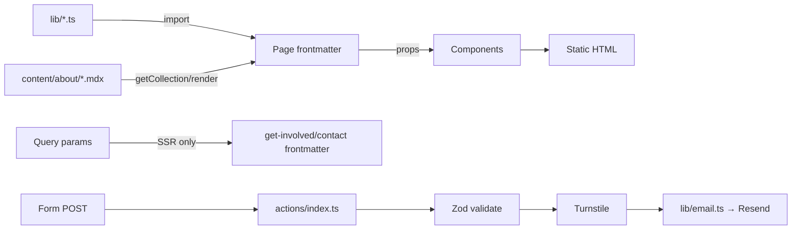

# PROJECT_CONTEXT.md — I LOVE SAI

> ⚠️ **PARTIALLY SUPERSEDED (2026-07-21).** This document was generated on
> 2026-06-29, *before* the front-door rework. Sections describing **Astro Actions,
> the contact/get-involved forms, Resend email (`RESEND_API_KEY`/`EMAIL_FROM`),
> Cloudflare Turnstile (`TURNSTILE_*`), `src/middleware.ts`, and the "two SSR
> routes"** no longer reflect the code — those were all removed and the site is now
> **fully static** (get-involved/contact are WhatsApp + email links; donations are an
> outbound **PayPal** link, not Donorbox). Do **not** re-introduce those secrets or
> code paths from this doc. For current state see **`AI_HANDOFF.md`** and
> **`PENDING.md`**, which are up to date.

> **The complete engineering source of truth for the I LOVE SAI website rebuild.**
> Written so that an engineer (human or AI) who has never seen this repository can
> understand the entire project, its decisions, its current state, and continue
> development immediately — without reading the source.
>
> Generated from a full repository audit on **2026-06-29**. Where this document and
> the code disagree, the code wins; flag the drift.

---

## Table of Contents

1. [Executive Summary](#1-executive-summary)
2. [Tech Stack](#2-tech-stack)
3. [Folder Architecture](#3-folder-architecture)
4. [Overall Architecture](#4-overall-architecture)
5. [Feature Inventory](#5-feature-inventory)
6. [User Flow](#6-user-flow)
7. [Component Documentation](#7-component-documentation)
8. [Data Flow](#8-data-flow)
9. [CMS / Content](#9-cms--content)
10. [Routing](#10-routing)
11. [Styling](#11-styling)
12. [Integrations](#12-integrations)
13. [Configuration](#13-configuration)
14. [Performance](#14-performance)
15. [Bug Audit](#15-bug-audit)
16. [Technical Debt](#16-technical-debt)
17. [TODO Audit](#17-todo-audit)
18. [Future Roadmap](#18-future-roadmap)
19. [Missing Features](#19-missing-features)
20. [Developer Workflow](#20-developer-workflow)
21. [Risks](#21-risks)
22. [Coding Conventions](#22-coding-conventions)
23. [Project History](#23-project-history)
24. [Current State Snapshot](#24-current-state-snapshot)
25. [Open Questions](#25-open-questions)
26. [AI Context](#26-ai-context)
27. [Developer Memory](#27-developer-memory)
28. [Additional Findings](#28-additional-findings)

---

## 1. Executive Summary

### What it is
A from-scratch rebuild of **ilovesai.com**, the website of **I LOVE SAI** — a global
devotional and charitable movement centred on **Shri Shirdi Sai Baba**. It replaces
an older WordPress site. The new site is a **static-first Astro 7 application** that
ships near-zero JavaScript, hosted on **Cloudflare Pages**.

### Who it is for
Devotees and well-wishers worldwide, spanning a wide age range and many first
languages, many of them not highly technical. The product values **clarity, warmth,
readability, reverence, and accessibility** over cleverness or flash. The visual
language is deliberately grounded in the **materials of Shirdi worship** (sandalwood
paste, marigold garlands, the ember of Baba's perpetual *dhuni* fire, kumkum, temple
brass) rather than generic "devotional warmth."

### Primary goals of the website
- Explain the mission, Sai Baba, and Shirdi to newcomers.
- Showcase ongoing projects and charitable activities.
- Let visitors get involved, register, and donate.
- Eventually serve a **global, multilingual** audience (English first; i18n-ready).

### Current maturity
**Structurally complete, content-incomplete.** Every page, route, layout, component,
form, and security surface described in the build plan exists and **the project type-checks
(`astro check`: 0 errors/0 warnings across 41 files) and builds cleanly (22 prerendered
pages + 2 server-rendered routes).** What is missing is almost entirely **real content
and external credentials**, not engineering:

- Devotional/historical/charitable copy is deliberately left as `[PLACEHOLDER: …]`
  (an explicit rule: never invent scripture, biography, or charitable-status text).
- Real photography is absent (every image renders a `PlaceholderImage` box).
- All external service credentials (Resend, Turnstile, Donorbox URL, per-region
  contact emails) are unset/placeholder.

It is, in effect, a **fully-wired but un-fueled site**: pour in content + keys and it
goes live.

### Biggest strengths
- **Exceptional engineering discipline and documentation.** `CLAUDE.md` +
  `docs/site-blueprint.md` capture the *reasoning* behind nearly every decision.
- **Security-first form handling** (Astro Actions + Zod + Turnstile + honeypot +
  fail-closed-in-production + HTML escaping + a strict per-page CSP).
- **Accessibility built in** (semantic HTML, AA contrast tokens, 44px tap targets,
  visible focus ring, `prefers-reduced-motion`, sr-only live regions).
- **Coherent, non-AI-looking design system** with a clear token vocabulary.
- **Near-zero client JS** — only two tiny vanilla scripts site-wide.

### Biggest weaknesses
- **Git hygiene is the single biggest risk.** The last commit (`09cad1b`) contains
  only the homepage. *Almost the entire site* — projects, events, locations, about,
  forms, actions, middleware, hardening — exists **only as uncommitted working-tree
  changes** (untracked files + staged deletions). One `git checkout .` / disk loss
  would erase the bulk of the project.
- **Pervasive placeholders** mean the site cannot launch without a content pass.
- **The Donate flow is currently broken** at runtime: `DONATE_URL` is a literal
  placeholder string, so every Donate button points at an invalid href.
- **A latent production email bug**: form recipient resolves to a placeholder email
  string that passes the truthiness guard (see [§15](#15-bug-audit)).

---

## 2. Tech Stack

| Technology | Version (installed) | Why it's here / how it's used |
| :--- | :--- | :--- |
| **Astro** | `7.0.0` | Core framework. Static-first; islands architecture; ships almost no JS. Whole site is Astro components/pages. |
| **Tailwind CSS** | `4.3.1` | Styling. **CSS-first config** via `@tailwindcss/vite` — there is **no `tailwind.config.js`**. Tokens live in `src/styles/global.css` under `@theme`. |
| **@tailwindcss/vite** | `4.3.1` | The Tailwind v4 Vite plugin (replaces the deprecated `@astrojs/tailwind` integration — **do not reintroduce that**). |
| **@tailwindcss/typography** | `0.5.20` | `.prose` styling for MDX long-form pages, re-themed onto the project's tokens. |
| **@astrojs/cloudflare** | `14.0.0` | SSR adapter for the two dynamic form routes; provides `cloudflare:workers` runtime env access, Cloudflare Images + KV session bindings. |
| **@astrojs/mdx** | `7.0.0` | MDX content collection support (the `about` pages embed components inline). |
| **@astrojs/sitemap** | `3.7.3` | Generates `sitemap-index.xml` at build. |
| **@fontsource/marcellus** | `5.2.8` | Self-hosted display font (headings). One weight (400). |
| **@fontsource/mukta** | `5.2.8` | Self-hosted body font. Weights 300/400/600/700. **Chosen for Devanagari coverage** (future Hindi/Marathi). |
| **wrangler** | `4.104.0` | Cloudflare CLI; `wrangler types` regenerates `worker-configuration.d.ts`. |
| **TypeScript** | `6.0.3` | `astro/tsconfigs/strict`. |
| **ESLint** | `9.39.4` | Flat config; `typescript-eslint` + `eslint-plugin-astro` + `jsx-a11y`. |
| **Prettier** | `3.8.4` | `prettier-plugin-astro` + `prettier-plugin-tailwindcss` (class sorting). |
| **Node** | `>=22.12.0` (engines) | Required runtime. |

**Notably absent (deliberately):** React/Vue/Svelte (no UI framework — plain Astro),
any external Google Fonts request (fonts self-hosted for privacy + tighter CSP),
**Sanity** (the CMS named in `CLAUDE.md` is *planned but deferred* — see [§9](#9-cms--content)),
any test framework, any analytics, Docker.

**Important version note:** `package.json` declares **caret ranges** for every
dependency (e.g. `astro: ^7.0.0`). This sits in tension with `CLAUDE.md`'s "pin
dependencies" rule. The committed `package-lock.json` + `npm ci` is the de facto
pinning today. The `astro: ^7.0.0` / `@astrojs/mdx: ^7.0.0` versions are unusually
high for Astro's real-world numbering — treat the lockfile as the ground truth.

---

## 3. Folder Architecture

```
ilovesai/
├── CLAUDE.md                  ← Source-of-truth project rules (read every session)
├── AGENTS.md                  ← Short note: dev-server background-mode + Astro docs links
├── README.md                  ← Public-facing quickstart (stack, commands, env)
├── PROJECT_CONTEXT.md         ← (this file)
├── AI_HANDOFF.md              ← Condensed LLM handoff
├── docs/
│   └── site-blueprint.md      ← Page-by-page build plan + build log + decisions
├── astro.config.mjs           ← Integrations, adapter, site URL, security.csp
├── wrangler.jsonc             ← Cloudflare Worker/Pages config (assets, observability)
├── worker-configuration.d.ts  ← Generated by `wrangler types` (Cloudflare.Env etc.)
├── tsconfig.json              ← extends astro/tsconfigs/strict
├── eslint.config.mjs          ← Flat ESLint config
├── .prettierrc.json / .prettierignore
├── .env.example               ← Documents the 4 runtime secrets (no real values)
├── .github/dependabot.yml     ← Weekly grouped npm updates
├── .mcp.json                  ← Context7 + Playwright MCP servers (dev tooling)
├── .claude/agents/            ← design-reviewer + security-reviewer subagent defs
├── .vscode/                   ← Astro extension recommendation + launch config
├── public/
│   ├── favicon.svg / favicon.ico
│   ├── logos/logo-color.svg   ← 177×70 brand logo (color)
│   ├── logos/logo-white.svg   ← 177×70 brand logo (white, footer)
│   ├── _headers               ← Cloudflare Pages security headers (static assets)
│   └── _redirects             ← 15 old-WordPress → new-route 301s
└── src/
    ├── styles/global.css      ← Tailwind import + @theme design tokens + base layer
    ├── env.d.ts               ← Declaration-merges 4 env vars into Cloudflare.Env
    ├── middleware.ts          ← Security headers for the SSR routes
    ├── content.config.ts      ← `about` MDX content collection schema (Zod)
    ├── actions/index.ts       ← Astro Actions: getInvolved + contact (form handlers)
    ├── lib/                    ← Typed local data fixtures + helpers
    │   ├── locations.ts        (Region type, locations[], getLocation, isPlaceholder)
    │   ├── projects.ts         (Project type, projects[], getProject)
    │   ├── events.ts           (Event type, events[], getUpcomingEvents)
    │   ├── gallery.ts          (GalleryImage type, galleryImages[], getGalleryImages)
    │   ├── donate.ts           (DONATE_URL constant — Donorbox hosted checkout)
    │   └── email.ts            (sendNotificationEmail — Resend API wrapper)
    ├── layouts/
    │   ├── BaseLayout.astro    (html shell: head + SiteHeader + main + SiteFooter)
    │   ├── ArticleLayout.astro (About sub-pages: hero + TOC + .prose)
    │   └── ProjectLayout.astro (Project detail: hero/quote/steps/list/CTA)
    ├── components/             ← Reusable UI (see §7)
    └── pages/                  ← File-based routes (see §10)
```

**Ownership / responsibility split**

- `src/lib/*` is the **data layer** — typed in-memory fixtures standing in for a
  future CMS. Pages/components *only* import from here, never inline their own data
  (except the homepage, which still has hardcoded placeholder cards — see [§15](#15-bug-audit)).
- `src/components/*` is **presentational** — props in, HTML out, mostly stateless.
- `src/layouts/*` are **page shells** — they own `<head>`, header/footer, and the
  large structural sections.
- `src/pages/*` are **route entry points** — they wire data (from `lib`) into layouts
  and components.
- `src/actions/index.ts` + `src/lib/email.ts` are the **server/security layer** —
  the only code that runs at request time.

---

## 4. Overall Architecture

### Rendering strategy
**Static-first hybrid.** By default every page is **prerendered to HTML at build
time** (SSG). Exactly **two** routes opt out with `export const prerender = false`:

- `/get-involved`
- `/contact`

These run as **Cloudflare Pages Functions** (SSR) because they read query params
server-side, read runtime env (`cloudflare:workers`), and process form POSTs via
Astro Actions. Everything else is pure static output.

```mermaid
flowchart TD
    subgraph Build[Build time — astro build]
        Lib[src/lib/*.ts fixtures] --> Pages
        MDX[src/content/about/*.mdx] --> AboutPages
        Pages[22 static pages] --> Dist[dist/ static HTML/CSS/JS]
        AboutPages --> Dist
        Sitemap[/@astrojs/sitemap/] --> Dist
    end
    subgraph Runtime[Request time — Cloudflare]
        Dist --> CDN[Cloudflare Pages CDN]
        CDN -->|static asset| Browser
        CDN -->|/get-involved, /contact| Fn[Pages Function SSR]
        Fn --> MW[middleware.ts security headers]
        Fn --> Actions[Astro Actions]
        Actions --> TS[Turnstile siteverify]
        Actions --> Resend[Resend email API]
    end
```

### Application architecture
A classic **content site**, not an app. No client-side router, no global state, no
hydration framework. "Islands" are minimal: two hand-written vanilla `<script>` tags
(mobile menu, events filter). All interactivity beyond those is **CSS-only**
(`:has()`-driven project-picker reveal, snap-scroll carousel, `<details>` TOC,
native `<dialog>` modal menu).

### Routing architecture
**File-based** (`src/pages/`). Static routes are `.astro` files; dynamic routes use
`[param].astro` + `getStaticPaths()`. See [§10](#10-routing).

### State management
**None on the client.** Server-side, the only "state" is:
- Query params (`?project=`, `?interest=`) read in page frontmatter to preselect form fields.
- Action results read via `Astro.getActionResult(actions.X)` to render success/error banners.

### Content flow
`src/lib/*` typed fixtures and `src/content/about/*.mdx` → imported into pages →
filtered/grouped/formatted in frontmatter → rendered through components/layouts →
static HTML. There is **no database and no live API** for content today.

### Server/client boundary
- **Server (build or request):** all `.astro` frontmatter, `src/actions`,
  `src/lib/email.ts`, `src/middleware.ts`, env access via `cloudflare:workers`.
- **Client:** the global stylesheet, self-hosted font files, the mobile-menu script
  (`SiteHeader.astro`), the events-filter script (`events/index.astro`), and the
  Turnstile script (only when a site key is configured).

Secrets **never** reach the client — they're read through `cloudflare:workers`'
`env`, not Vite's `import.meta.env`, so they can't be inlined into client bundles.

---

## 5. Feature Inventory

### 5.1 Homepage (`/`)
- **Purpose:** orient a newcomer; route them to projects, participation, location, donation.
- **UX:** `Hero` (eyebrow + "Sabka Malik Ek" heading + lead + one CTA + a 3-slide
  carousel, wrapped in the signature `.dhuni-glow`) → "Latest from our projects"
  (4 `ProjectCard`s) → "Our Vision" (image + text) → a marigold hairline + a quiet
  devotional line → "Ways to Participate" (3 `CTACard`s: Donate / Serve / Organise)
  → "Where We Are" (India · UK · USA links) → kumkum donate band.
- **Implementation:** `src/pages/index.astro` + `Hero`, `ProjectCard`, `CTACard`,
  `PlaceholderImage`.
- **Limitations / bugs:** project cards and participate options are **hardcoded
  placeholder data inline**, *not* sourced from `src/lib/projects.ts`; the project
  cards have **no `href`** (not clickable) and the Serve/Organise CTAs link to `#`.
  This is inconsistent with every other page, which uses the real data layer.
- **Future:** swap inline arrays for `projects`/real copy; make cards link to detail pages.

### 5.2 About hub (`/about`, `/about/{movement,sai-baba,shirdi}`)
- **Purpose:** explain the movement, Sai Baba, and Shirdi.
- **UX:** `/about` is a 3-card landing (cards from MDX frontmatter `title`/`essence`).
  Each sub-page renders through `ArticleLayout`: a `.dhuni-glow` hero, then `.prose`
  long-form content with a **sticky sidebar Table of Contents on `lg:`** and a
  `<details>` disclosure TOC on mobile — shown only when a page has **≥3 `<h2>`s**
  (all three currently do).
- **Implementation:** MDX content collection (`src/content/about/*.mdx`,
  `src/content.config.ts`), `ArticleLayout.astro`, `PullQuote`, `Timeline`,
  `PlaceholderImage`. TOC is built from Astro's `render(entry)` `headings` (depth===2).
- **Limitations:** **content is structure-only.** Every paragraph is `[PLACEHOLDER]`.
  Per an explicit rule, **no scripture, biography, Eleven Assurances wording, or
  Satcharitra citations were drafted** — only the headings they'll slot into. The
  one real piece of content: `movement.mdx` interpolates region labels from
  `src/lib/locations.ts`.

### 5.3 Projects (`/projects`, `/projects/[slug]`)
- **Purpose:** showcase the four real charitable projects.
- **UX:** index = intro line (placeholder) + responsive `ProjectCard` grid. Each
  detail page = hero (location eyebrow + title + essence + intro + image) → optional
  pull-quote → optional **numbered stepper** ("How It Works", only when a genuine
  sequence exists) → a bullet list under a configurable heading → a CTA band → an
  unconditional "Explore our other projects → /projects" link.
- **Implementation:** `src/pages/projects/index.astro`, `src/pages/projects/[slug].astro`
  (single dynamic route over `projects`), `ProjectLayout.astro`, `ProjectCard`,
  `PullQuote`, `PlaceholderImage`. Data: `src/lib/projects.ts`.
- **The four real projects (real copy, sourced from the live site):**
  1. **Aao Sai** — free home devotional event; has the 3-step stepper (Before/During/After);
     CTA → `/get-involved?project=aao-sai#form`; closing line "Know Sai, Know Life — No Sai, No Life".
  2. **Carpentersville** (USA) — restoring a 134-year-old Illinois property into a
     charitable hub; "What Your Support Funds" list; CTA → external Donorbox (`ctaExternal`).
  3. **Walk for Sai** — spiritual walking event (5/10/100 miles, India/UK/USA);
     CTA → `/get-involved`; intentionally no closing tagline (none on the original site).
  4. **Babanchi Shirdi, Majhi Shirdi** (India) — Shirdi street restoration with the
     Green N Clean Shirdi Foundation; *Satcharitra* Ch. 5 V. 38–39 quote; CTA → Donorbox.
- **Limitations:** images are placeholders; Aao Sai/Walk for Sai have no `location`
  tag (not region-specific, by design). "Related projects" grid was deliberately
  dropped (the four split into two different *kinds*).

### 5.4 Events (`/events`, `/events/[slug]`)
- **Purpose:** surface upcoming devotional/charity events.
- **UX:** `UpcomingEvents` list at top → "All Upcoming Events" grouped under month
  `<h2>`-style headings, with **Type and Location radio filters**. Filtering is a
  small vanilla-JS script (not CSS-only — CSS couldn't cleanly hide a now-empty month
  heading) with an **`sr-only` live region** announcing the visible count.
- **Implementation:** `events/index.astro`, `events/[slug].astro` (dynamic over **all**
  events incl. past, so old links resolve), `UpcomingEvents`, `EventCard`. Data: `src/lib/events.ts`.
- **Limitations:** all event data is **fixture/sample** with dates generated relative
  to `Date.now()` (so the upcoming filter always has past/future entries to demo).
  Titles/summaries are `[PLACEHOLDER]`. No calendar/month-grid view (deferred).

### 5.5 Locations (`/locations`, `/locations/[region]`)
- **Purpose:** show where the movement operates (India / UK / USA) and local contact.
- **UX:** index = a card per region whose description is **computed**, not authored
  ("1 project · 2 upcoming events", derived by filtering `projects`/`events`). Region
  pages = hero + local contact + per-region photo gallery (`Carousel`) + region-filtered
  Projects + region-filtered Events; sections omitted when empty (UK has zero projects
  by design). **No map** (three fixed locations don't need one).
- **Implementation:** `locations/index.astro`, `locations/[region].astro` (URL slugs
  lowercased: `/locations/india`), `Carousel`, `ProjectCard`, `EventCard`. Data:
  `src/lib/locations.ts` + `src/lib/gallery.ts`.
- **Limitations:** contact details and gallery photos are all placeholders; contact
  links use the `isPlaceholder()`-gated `mailto:`/`tel:` treatment (renders plain
  text until real values exist).

### 5.6 Get Involved (`/get-involved`) — SSR
- **Purpose:** structured volunteer/participation intake (replaces an informal
  WhatsApp signup). **Not** a volunteer portal — a human triages every submission.
- **UX:** 3 `CTACard`s (Donate → Donorbox; Serve → `?interest=volunteer#form`;
  Organise/Host → `?interest=project#form`) then a form: name, email, region (`<select>`),
  an "I'm interested in" radio group (Volunteer/Donate/General/Project), a
  **conditionally-revealed project picker** (CSS `:has()`, zero JS), optional message.
  Deep-linkable via `?interest=` and `?project=<slug>` (query params so the preselect
  works **server-side with no JS**).
- **Security (in order):** honeypot (`_gotcha`, off-screen, `aria-hidden`) → Cloudflare
  Turnstile (widget + server `siteverify`) → Zod validation → fail-closed in production
  if `TURNSTILE_SECRET_KEY` is unset → HTML-escape every interpolated field in the
  email → route the email to `getLocation(region)?.email` with `replyTo` = visitor.
- **Implementation:** `src/pages/get-involved.astro` (`prerender = false`),
  `src/actions/index.ts` → `server.getInvolved`, `src/lib/email.ts`.
- **Limitations / pending:** Turnstile widget and Resend send are **wired but inert**
  until keys exist; per-region recipient emails are placeholders; **rate limiting is
  a post-deploy Cloudflare dashboard rule, not built**.

### 5.7 Contact (`/contact`) — SSR
- **Purpose:** direct contact + per-region contact cards.
- **UX:** per-region cards (name/email/phone, `mailto:`/`tel:` once real) + a simpler
  form (name, email, region, **required** message — no interest/project picker).
- **Implementation:** `src/pages/contact.astro` (`prerender = false`),
  `src/actions/index.ts` → `server.contact`. **Reuses the action/security layer**
  (`verifyTurnstile` is shared); the form UI is built inline, not a shared component.
- **Limitations:** same pending items as Get Involved (keys, rate limit, real emails).

### 5.8 Donate (hosted checkout)
- **Purpose:** accept donations **without ever touching card data** (PCI scope SAQ-A).
- **UX:** not a page — a single `DONATE_URL` constant linked from many places
  (header ×2, homepage band, Get Involved `CTACard`, Carpentersville & Babanchi CTAs),
  opened in a new tab with `rel="noopener"` and a visually-hidden "(opens in a new tab)".
- **Implementation:** `src/lib/donate.ts`. Provider: **Donorbox** (plain hosted-page
  redirect, *not* the embeddable widget — the widget would force a CSP change).
- **Limitation / BUG:** `DONATE_URL` is still the literal string
  `'[PLACEHOLDER: real Donorbox hosted donation page URL]'` → every Donate link is
  currently broken (see [§15](#15-bug-audit)).

### 5.9 404 (`/404`)
- Custom not-found page reusing `BaseLayout`, with three recovery links (Home,
  Projects, Contact). Acts as the safety net for unmapped/WordPress-system paths.

### 5.10 Security hardening (cross-cutting)
- **CSP** via Astro's native `security.csp` (per-page `<meta>` tag, auto-hashes
  Astro's inlined scripts/styles). Base directives: `default-src 'self'`,
  `img-src 'self' data:`, `object-src 'none'`, `base-uri 'self'`, `form-action 'self'`.
  Turnstile's origin is added **only** on the two form pages, **only** when a site key exists.
- **Security headers** via `public/_headers` (static assets) **and** `src/middleware.ts`
  (SSR routes) — `X-Content-Type-Options`, `X-Frame-Options: SAMEORIGIN`,
  `Referrer-Policy`, `Permissions-Policy`, `Cross-Origin-Opener-Policy`,
  `Cross-Origin-Resource-Policy`, `Strict-Transport-Security` (no `preload` yet).
- **Redirects** via `public/_redirects` (15 rules from the old WordPress URLs).

---

## 6. User Flow

### Global chrome (every page)
- **Header** (`SiteHeader`): sticky, `z-20`, brass bottom border. Left = `Logo`
  (links home). Desktop (`lg:`): primary nav (About/Projects/Events/Get Involved/Contact)
  + quick-action "Request Aao Sai" + marigold **Donate** button (new tab). Mobile:
  a 44×44 hamburger opening a **native `<dialog>` full-screen menu** (focus-trapped
  by `showModal()`, Esc closes, `aria-expanded` toggled in script).
- **Footer** (`SiteFooter`): kumkum-deep background, white logo, placeholder mission
  one-liner, placeholder contact email, region quick-links, brass hairline, placeholder
  charity registration line, auto-year copyright.

### Page-by-page

**Home** — land on hero ("Sabka Malik Ek"), one primary CTA scrolls to `#participate`.
Scroll past project cards (currently non-clickable placeholders), a vision block, a
quiet devotional divider line, the 3 participation cards (Donate works → Donorbox once
set; Serve/Organise currently `#`), the India·UK·USA links (→ region pages), and a
final Donate band.

**About** — pick one of three cards → read a long-form page with a TOC. Headings jump
within the page. All prose is placeholder.

**Projects** — browse 4 cards → open a project. Aao Sai shows the Before/During/After
stepper and a "Request Aao Sai" CTA that deep-links the Get Involved form with the
project preselected. Carpentersville/Babanchi show a "support" CTA → Donorbox (new tab).
Every project ends with "Explore our other projects".

**Events** — see the upcoming list, then filter the card grid by Type/Location (radios);
empty month groups disappear; a screen-reader live region announces the count. Click a
card → event detail (date/time, optional body, optional Register button).

**Locations** — see 3 region cards with computed counts → open a region → local contact,
photo carousel, region projects, region events. UK shows no projects section (none exist).

**Get Involved** — choose a path (cards) or scroll to the form. Selecting "Get involved
with a project" reveals the project dropdown (CSS-only). Submit:
- **Success:** `role="status"` banner "Thank you — we'll be in touch soon."
- **Error:** `role="alert"` banner with the action's message.
- **No-JS:** works fully (plain `<form method="POST">`, result read server-side).
- **Honeypot tripped:** silent fake success (no email).

**Contact** — per-region cards + a message form (message required). Same submit states.

### Loading / empty / error states
- **Empty events:** `UpcomingEvents` and the events index both render
  "No upcoming events right now — check back soon."
- **Empty region sections:** simply omitted (no empty headings).
- **Missing images:** `PlaceholderImage` box with a label.
- **Form errors:** action-level banner; field-level Zod messages are defined but the
  UI renders only the top-level `result.error.message`.
- **404:** custom page with recovery links.

### Animations / transitions
Deliberately restrained: `.dhuni-glow` radial ember behind heroes, `scroll-behavior:
smooth`, hover shadow-lift on cards, hover color shifts. **All motion is disabled under
`prefers-reduced-motion`** via a global rule.

---

## 7. Component Documentation

All components are `.astro`, props-in/HTML-out, mostly stateless. "State" exists only
in the two that ship a `<script>`.

| Component | Props | Internal state / logic | Used by | Notes / limits |
| :--- | :--- | :--- | :--- | :--- |
| **Logo** | `variant?: 'color'\|'white'`, `class?` | none | SiteHeader, SiteFooter | `<a href="/">` with `aria-label`; `alt=""` safe because the link is labelled. 177×70, default `h-11` (≥44px tap target). |
| **SiteHeader** | none | mobile `<dialog>` open/close + `aria-expanded` toggle (vanilla JS) | BaseLayout | Sticky. Nav + quick-action + Donate. Native `<dialog>` focus-trap. ESLint exception nearby. |
| **SiteFooter** | none | computes current year | BaseLayout | Kumkum bg, white logo, region links from `locations`. Several `[PLACEHOLDER]` lines. |
| **Hero** | `eyebrow?`, `heading`, `lead?`, `ctaLabel?`, `ctaHref?`, `slides[]` | none | Home | Wraps `Carousel`; renders the page `<h1>`. `.dhuni-glow`. |
| **Carousel** | `slides[]` (`{image?, alt, caption?}`), `ariaLabel?` | none (CSS scroll-snap) | Hero, region pages | Focusable scroll region (WAI G202 pattern). Dot links jump to `#slide-N`. `tabindex="0"` on the `<ul>`. |
| **ProjectCard** | `title`, `description?`, `href?`, `image?`, `imageAlt?`, `location?`, `headingLevel?: 'h2'\|'h3'` | none | Home, /projects, /about, /locations, region pages | Renders `<a>` if `href` else `<div>`. `line-clamp-2` description. `headingLevel` prevents H1→H3 skips on hub pages. Reused well beyond "projects". |
| **CTACard** | `title`, `description`, `href`, `label`, `image?`, `imageAlt?`, `external?` | none | Home, /get-involved | `external` adds `target=_blank rel=noopener` + sr-only "(opens in a new tab)". |
| **EventCard** | `title`, `summary`, `href`, `start`, `location`, `type`, `image?`, `imageAlt?`, `headingLevel?: 'h3'\|'h4'` | `Intl.DateTimeFormat` (hardcoded `'en'`) | /events, region pages | Exports `eventTypeLabels` map. `data-type`/`data-location` drive the filter script. |
| **UpcomingEvents** | `count?` (default 5) | calls `getUpcomingEvents`, formats dates | /events (and intended for Home) | Compact list, not a card grid. Empty-state message. |
| **PullQuote** | `text`, `attribution` | none | ProjectLayout, MDX | Marigold left-border blockquote; `<cite>` not italic (house style). |
| **Timeline** | `events[]` (`{year,label,body}`) | none | sai-baba.mdx | Vertical connected-dot timeline. Currently placeholder entries. |
| **PlaceholderImage** | `label?` | none | everywhere images go | Brass-bordered cream box with a centered eyebrow label. The visible stand-in for all missing photography. |

**Relationships:** `BaseLayout` → `SiteHeader` (→ `Logo`) + `SiteFooter` (→ `Logo`).
`Hero` → `Carousel` → `PlaceholderImage`. `ProjectLayout`/`ArticleLayout` extend
`BaseLayout`. Cards and `PlaceholderImage` are the shared leaf components.

**Reusability note:** `ProjectCard` is the project's workhorse card — used for
projects, about entries, and location regions. Its optional `description`, `location`,
and `headingLevel` props are what make it general.

---

## 8. Data Flow

### Where data originates
1. **Typed fixtures** in `src/lib/*.ts` — `locations`, `projects`, `events`,
   `galleryImages`, plus the `DONATE_URL` constant. These are hand-authored TypeScript
   arrays/objects, standing in for a future CMS.
2. **MDX files** in `src/content/about/*.mdx` — frontmatter (`title`, `essence`,
   Zod-validated by `content.config.ts`) + body prose/components.
3. **Request input** (SSR pages only) — URL query params and `POST` form bodies.
4. **Runtime env** — `RESEND_API_KEY`, `EMAIL_FROM`, `TURNSTILE_SITE_KEY`,
   `TURNSTILE_SECRET_KEY` via `cloudflare:workers`.

### How it moves / is transformed
- Pages import fixtures and **filter/sort/group/format in frontmatter** (e.g. events
  grouped by month via `Intl.DateTimeFormat`; region pages filter by
  `location === region`; `describeRegion()` computes counts).
- `getStaticPaths()` turns the `projects`/`events`/`locations`/`about` arrays into
  prerendered routes.
- Components receive already-shaped props; only `EventCard`/`UpcomingEvents` do their
  own date formatting.
- Form data → Zod parse → (honeypot short-circuit) → Turnstile verify → recipient
  lookup → HTML-escaped email body → Resend.

### Where it's cached / rendered
- **SSG pages:** transformed once at build, served as static HTML (CDN-cached;
  `_astro/*` gets immutable `Cache-Control` injected by the adapter).
- **SSR pages:** rendered per request in a Pages Function.
- No application-level caching; no client data fetching.



---

## 9. CMS / Content

### Today: two content models, both local
1. **Typed TS fixtures** (`src/lib/*`) — for structured, list-like content
   (locations, projects, events, gallery). Pattern: an exported `interface`/`type`,
   an exported array, and lookup/derivation helpers (`getLocation`, `getProject`,
   `getUpcomingEvents`, `getGalleryImages`, `isPlaceholder`).
2. **MDX content collection** (`src/content/about/*.mdx`) — for long-form prose, the
   only place where Astro's `getCollection`/`render` and heading extraction are used.

**Content collection schema** (`src/content.config.ts`):
```ts
const about = defineCollection({
  loader: glob({ pattern: '**/*.mdx', base: './src/content/about' }),
  schema: z.object({ title: z.string(), essence: z.string() }),
});
```
Three entries: `movement`, `sai-baba`, `shirdi`. Each renders via `ArticleLayout`;
the TOC is derived from `render(entry).headings` (depth 2).

### Relationships
- `projects` and `events` reference a location by its `Region` **key** (not an
  embedded object) — this is how the site filters/groups by place without duplicating
  data. `gallery` keys photos by `Region` too.
- Region pages join all four datasets at build time.

### Validation
- MDX frontmatter: Zod via the collection schema.
- Form input: Zod schemas in `src/actions/index.ts` (email validity, required fields,
  enum regions/interests, a `.refine()` requiring a project when interest === 'project').

### Content workflow (current)
Edit a `.ts` fixture or `.mdx` file → rebuild → deploy. Non-technical editing is
**not yet possible**.

### Planned: Sanity (deferred)
`CLAUDE.md` names **Sanity** as the headless CMS so non-technical members can edit
content (e.g. homepage carousel images), with schemas under `sanity/schemaTypes/`.
**This does not exist yet** — there is no `sanity/` directory, no client, no
`@sanity/*` dependency. It was deliberately deferred multiple times. The data layer
is structured so a future Sanity swap is *contained* to `src/lib/*` (consumers only
call helpers), though a live query would likely make those helpers async.

### Limitations
- No live editing, no preview, no media library — everything is code + rebuild.
- Nearly all content is `[PLACEHOLDER]`; the four projects are the main exception.

---

## 10. Routing

| Route | File | Mode | Notes |
| :--- | :--- | :--- | :--- |
| `/` | `pages/index.astro` | SSG | Homepage |
| `/about` | `pages/about/index.astro` | SSG | 3 MDX cards |
| `/about/[slug]` | `pages/about/[slug].astro` | SSG | `movement`, `sai-baba`, `shirdi` |
| `/projects` | `pages/projects/index.astro` | SSG | Card grid |
| `/projects/[slug]` | `pages/projects/[slug].astro` | SSG | 4 projects |
| `/events` | `pages/events/index.astro` | SSG | List + filtered grid (client JS) |
| `/events/[slug]` | `pages/events/[slug].astro` | SSG | All events incl. past |
| `/locations` | `pages/locations/index.astro` | SSG | Computed region cards |
| `/locations/[region]` | `pages/locations/[region].astro` | SSG | `india`/`uk`/`usa` (lowercased) |
| `/get-involved` | `pages/get-involved.astro` | **SSR** | `prerender = false`; Action + query preselect |
| `/contact` | `pages/contact.astro` | **SSR** | `prerender = false`; Action |
| `/404` | `pages/404.astro` | SSG | Custom not-found |

**Dynamic routes** all use `getStaticPaths()` over the corresponding fixture/collection.

**API routes:** none in the traditional sense — form handling is **Astro Actions**
(`src/actions/index.ts`), invoked via `actions.getInvolved` / `actions.contact`,
not REST endpoints.

**Middleware:** `src/middleware.ts` sets security headers on responses (matters for
the SSR routes; static assets get headers from `_headers`).

**Redirects** (`public/_redirects`, 15 × 301):
`/mission/`, `/a-global-sai-movement/`, `/babas-grace/` → `/about/movement`;
`/about-us/` → `/about`; `/about-us/about-sai-baba/` → `/about/sai-baba`;
`/about-us/about-shirdi/` → `/about/shirdi`; `/our-projects/` → `/projects`;
the four project slugs → their detail pages; `/get-involved/` → `/get-involved`;
`/organise-charitable-activities/` → `/get-involved?interest=project`;
`/contact-us/` → `/contact`; `/registration/` → `/get-involved`.
WordPress system paths (`/wp-admin/` etc.) are deliberately **not** redirected (the
404 catches them).

**Metadata / SEO:** `BaseLayout` sets `<title>`, `<meta name="description">`,
favicons, viewport, charset. `astro.config.mjs` sets `site: 'https://ilovesai.com'`.
`@astrojs/sitemap` emits `sitemap-index.xml`. **No Open Graph / Twitter card tags
or canonical URLs yet** (the OG share image is a known outstanding asset).

---

## 11. Styling

### System
**Tailwind CSS v4, CSS-first.** All design tokens live in `src/styles/global.css`
under `@theme`; Tailwind auto-generates utilities from them
(`--color-marigold` → `bg-marigold`/`text-marigold`, `--text-h1` → `text-h1`,
`--font-display` → `font-display`, etc.). **There is no `tailwind.config.js`.**

### Theme tokens (the design vocabulary)

**Colour — "the materials of Shirdi worship":**
| Token | Hex | Role |
| :--- | :--- | :--- |
| `sandal` | `#f3ead8` | page background |
| `sandal-deep` | `#e7d8bc` | secondary surface / cards |
| `marigold` | `#e58a1a` | **primary accent** (garland saffron) |
| `ember` | `#c2520e` | hover/active (dhuni flame) |
| `kumkum` | `#6b1e25` | headings, footer, depth |
| `kumkum-deep` | `#4a141a` | footer base |
| `brass` | `#a9803c` | fine dividers/detail |
| `brass-text` | `#6e5327` | AA-safe brass on light surfaces |
| `ink` | `#2a211b` | body text (**never** pure black) |
| `ink-soft` | `#5a4d42` | secondary text/captions |
| `cream` | `#fbf6ec` | lightest panel surface |

**Type:** `--font-display` = Marcellus (headings), `--font-body` = Mukta (body,
ships Devanagari). Fluid scale via `clamp()`: `text-display`, `text-h1`…`text-h3`,
`text-lead`, `text-body` (17px), `text-small`, `text-eyebrow`.

**Radius:** `sm 0.25rem`, `md 0.5rem`, `lg 0.875rem` (modest — no pill-everything).
**Shadows:** warm-tinted (`shadow-soft`, `shadow-lift`), not neutral grey.
**Layout:** `--spacing-gutter: 1.5rem` (→ `px-gutter`), `--breakpoint-3xl: 110rem`,
`--measure: 68ch` (readable line length, applied to `<p>`).

### Base layer (the quality floor)
- `body`: sandal bg, ink text, Mukta, 17px, line-height 1.65.
- Headings: Marcellus, kumkum, `text-wrap: balance`, single weight.
- `<p>` capped at `--measure`, centered via `margin-inline: auto`.
- Links: ember resting, kumkum hover.
- `.eyebrow`: uppercase tracked brass label.
- `.prose`: Tailwind Typography re-themed onto tokens (links kumkum, not ember, for
  AA on cream; blockquotes not italic).
- `:focus-visible`: 2px ember outline (the accessibility focus ring).
- `.dhuni-glow`: the signature radial ember glow (`::before`, `z-index:-1`).
- `prefers-reduced-motion`: nukes all animation/transition durations + smooth scroll.

### Responsive strategy
Mobile-first Tailwind breakpoints (`sm`/`md`/`lg`/`3xl`). Grids step 1→2→3→4 cols;
header swaps nav↔hamburger at `lg`; ArticleLayout TOC goes sidebar at `lg`.

### Dark mode
**None.** `color-scheme: light` is set explicitly; the palette is intentionally light/warm.

### Component-scoped styles
A few `.astro` `<style>` blocks (mobile menu dialog, honeypot off-screen, project-picker
`:has()` reveal). Reminder in `global.css`: inside an `.astro` `<style>` using `@apply`,
add `@reference "../styles/global.css";` first.

---

## 12. Integrations

| Integration | Status | How it works |
| :--- | :--- | :--- |
| **Cloudflare Pages** (hosting) | configured | `@astrojs/cloudflare` adapter; `wrangler.jsonc` (assets dir `./dist`, `ASSETS` binding, observability on, compat date `2026-06-24`, `global_fetch_strictly_public` flag). Build auto-injects Cloudflare Images (`IMAGES`) + KV session (`SESSION`) bindings. |
| **Cloudflare Turnstile** (CAPTCHA) | wired, inert | Widget renders only if `TURNSTILE_SITE_KEY` set; server `siteverify` in `verifyTurnstile()` using `TURNSTILE_SECRET_KEY` + `context.clientAddress`. CSP allows `challenges.cloudflare.com` only on form pages when keyed. |
| **Resend** (transactional email) | wired, inert | `src/lib/email.ts` POSTs to `https://api.resend.com/emails` with `RESEND_API_KEY`/`EMAIL_FROM`; no-ops with a warning if unset. Recipient = per-region `getLocation(region)?.email`. |
| **Donorbox** (donations) | placeholder | `DONATE_URL` constant; plain hosted-page redirect (new tab). Must **not** become the embed widget without a CSP change. |
| **@astrojs/sitemap** | active | `sitemap-index.xml` at build. |
| **Self-hosted fonts** (`@fontsource`) | active | Marcellus + Mukta imported in `global.css`; no external font request. |
| **Context7 MCP** (dev only) | configured | `.mcp.json`; live library docs during development. |
| **Playwright MCP** (dev only) | configured | `.mcp.json`; live-browser a11y/CSP verification during development. |
| **Dependabot** | configured | Weekly grouped (minor+patch) npm PRs, limit 5. |

**No** analytics, auth provider, image CDN (yet), or third-party JS beyond Turnstile.

### Required runtime secrets (`.env.example`, set via `.dev.vars` locally / Cloudflare in prod)
`RESEND_API_KEY`, `EMAIL_FROM`, `TURNSTILE_SECRET_KEY`, `TURNSTILE_SITE_KEY`. These are
read via `cloudflare:workers`' `env`, **not** Vite `.env`, so they stay server-side.
`src/env.d.ts` declaration-merges them (all optional) into `Cloudflare.Env`.

---

## 13. Configuration

### `package.json` scripts
| Script | Command | Purpose |
| :--- | :--- | :--- |
| `dev` | `astro dev` | Local HMR dev server |
| `build` | `astro build` | Production build → `./dist/` |
| `preview` | `astro preview` | Preview the build locally |
| `check` | `astro check` | Type + template diagnostics |
| `lint` | `eslint .` | Lint |
| `format` | `prettier --write .` | Format |
| `generate-types` | `wrangler types` | Regenerate `worker-configuration.d.ts` |

**Required gate before "done":** run `check`, `lint`, **and** `build`.

### `astro.config.mjs`
- `site: 'https://ilovesai.com'`
- `vite.plugins: [tailwindcss()]`
- `integrations: [mdx(), sitemap()]`
- `adapter: cloudflare()`
- `security.csp.directives`: the base CSP (see [§5.10](#5-feature-inventory) / [§11](#11-styling)).
  A long comment explains why CSP is a `<meta>` tag, not a header (Astro inlines its
  own scripts/styles; `frame-ancestors` loss is covered by `X-Frame-Options`).

### TypeScript / lint / format
- `tsconfig.json`: extends `astro/tsconfigs/strict`; includes `.astro/types.d.ts`,
  `**/*`, `worker-configuration.d.ts`; excludes `dist`.
- `eslint.config.mjs`: flat config — `typescript-eslint` recommended + Astro flat
  recommended + Astro jsx-a11y recommended + `eslint-config-prettier`. One scoped
  exception: `no-noninteractive-tabindex` off for `Carousel.astro` (WAI G202 scroll region).
- `.prettierrc.json`: single quotes, printWidth 100, Astro + Tailwind class-sort
  plugins. `.prettierignore` skips build output, lockfile, and prose `*.md`.

### CI/CD
- **No GitHub Actions workflows** (`.github/` contains only `dependabot.yml`).
- Deployment is expected via Cloudflare Pages' own Git integration (build `dist/`,
  `_headers`/`_redirects` consumed natively).

---

## 14. Performance

- **Near-zero JS by design.** Only client scripts: the mobile-menu toggle
  (`SiteHeader`), the events filter (`events/index.astro`), and the Turnstile script
  (form pages, only when keyed). No hydration framework.
- **Static-first:** 22 pages are pure prerendered HTML served from Cloudflare's CDN;
  `_astro/*` assets get immutable `Cache-Control` injected at build.
- **Fonts self-hosted** (no render-blocking external font request); only the weights
  used are imported (Mukta 300/400/600/700, Marcellus 400).
- **Images:** none real yet. Interfaces accept `ImageMetadata | string`, so Astro's
  image pipeline is available, but today everything is a CSS `PlaceholderImage` box →
  zero image payload. **When real photos land, wire them through `ImageMetadata`/`<Image>`
  to get optimization** (this is the main future perf task).
- **CSS:** one global stylesheet + small scoped blocks; Tailwind v4 tree-shakes unused
  utilities.
- **Known/foreseeable bottlenecks:** unoptimized images once added; the events filter
  script queries the DOM on every change (trivial at current scale); no `loading="lazy"`
  on images yet (no real images to lazy-load).

---

## 15. Bug Audit

> Evidence-based only. Severity is the auditor's judgment.

### Confirmed / high-confidence

1. **`DONATE_URL` is a broken href (High).** `src/lib/donate.ts:9` —
   `DONATE_URL = '[PLACEHOLDER: …]'`. Every Donate link (header ×2, homepage band,
   Get Involved card, Carpentersville & Babanchi CTAs) renders this literal string as
   `href`. Clicking navigates to a bogus relative URL (404/garbage). **Blocks the
   entire donation flow** until replaced with the real Donorbox URL.

2. **Form recipient resolves to a placeholder email in production (High, latent).**
   `getLocation(region)?.email` returns e.g. `'[PLACEHOLDER: India contact email]'`,
   which is **truthy**, so the `if (!to)` guard in both actions
   (`actions/index.ts:81`, `:131`) does **not** catch it. Today it's masked because
   Resend is a no-op without a key. **The moment `RESEND_API_KEY` is set without also
   fixing `locations.ts`, every submission will POST an invalid `to` to Resend → API
   error thrown → 500 for the user.** Fix: replace placeholder emails *and/or* gate
   on `isPlaceholder(to)` (the helper already exists).

3. **Resend `reply_to` field name mismatch (Medium, likely).** `src/lib/email.ts:27`
   sends `{ ...(replyTo ? { replyTo } : {}) }`. Resend's REST API expects the field
   **`reply_to`** (snake_case), not `replyTo`. As written, the reply-to address the
   actions carefully set (so organizers can hit "reply") is likely **silently ignored**
   by Resend. Verify against current Resend API docs and rename if confirmed.

### UX / consistency issues

4. **Homepage project cards are dead + placeholder (Medium).** `pages/index.astro`
   hardcodes 4 project cards with **no `href`** and placeholder descriptions, instead
   of mapping `src/lib/projects.ts`. They're non-clickable and inconsistent with
   `/projects`. Serve/Organise participate cards link to `#`.

5. **No OG/Twitter/canonical meta (Low/SEO).** `BaseLayout` lacks Open Graph and
   Twitter card tags and `<link rel="canonical">`. Social shares will look bare; the
   OG image asset is a known outstanding item.

### Not bugs, but worth stating

6. **CSP cannot carry `frame-ancestors`** (meta-tag limitation) — *intentional*,
   covered by `X-Frame-Options: SAMEORIGIN`.
7. **Shiki inline-style CSP warning** at build — inert today (no fenced code blocks in
   any MDX); will matter if code blocks are ever added to `about` content.
8. **No rate limiting on the SSR form endpoints** — *intentionally deferred* to a
   Cloudflare dashboard rule, but until configured the endpoints are effectively open
   (Turnstile + honeypot are the only throttle).

### Security posture (otherwise strong)
No secrets in the repo; card data never touched; server-side validation + Turnstile +
honeypot + fail-closed-in-production; user input HTML-escaped before email; strict CSP;
full security-header set on both static and SSR responses.

---

## 16. Technical Debt

- **Git debt (critical, see [§24](#24-current-state-snapshot)):** the working tree is
  far ahead of `HEAD`; almost everything is uncommitted. Highest-priority cleanup.
- **Placeholder-as-data conflation:** placeholder strings live *in* the data arrays
  (`locations.ts` emails, `donate.ts` URL). Because some are truthy, they can slip
  past guards (bug #2). The `isPlaceholder()` helper exists but isn't applied at the
  action layer. Consider centralizing placeholder handling.
- **Two near-identical form pages/actions:** `get-involved.astro` and `contact.astro`
  duplicate a lot of markup (inputs, honeypot, Turnstile, banners) and the two actions
  duplicate the email-send shape. The *security-critical* code (`verifyTurnstile`) is
  correctly shared; the UI/handler boilerplate is not. Acceptable at two consumers;
  revisit if a third form appears.
- **Caret dependency ranges vs. "pin dependencies" rule** — manifest uses `^`; lockfile
  is the real pin. A repo-wide tightening pass is noted but not done.
- **Hardcoded `'en'` locale** in `EventCard`/`UpcomingEvents` `Intl.DateTimeFormat` —
  flagged in-code as "switch to page locale once i18n exists."
- **Homepage not on the data layer** (bug #4) — structural inconsistency.
- **No tests** — correctness rests on `astro check` + manual/Playwright review.

---

## 17. TODO Audit

There are **no literal `TODO`/`FIXME`/`HACK`/`XXX` markers** in the code. Outstanding
work is tracked instead as `[PLACEHOLDER: …]` strings and prose notes in
`docs/site-blueprint.md`. Inventory:

**`[PLACEHOLDER]` content (must be filled before launch):**
- `donate.ts` — real Donorbox URL.
- `locations.ts` — per-region city, contactName, email (×3 regions).
- `projects.ts` — 4 project `imageAlt` (real photos).
- `events.ts` — all 6 events are sample data (titles/summaries/dates).
- `gallery.ts` — all 6 gallery slots.
- `SiteFooter.astro` — mission one-liner, contact email, charity registration name/number.
- Homepage (`index.astro`) — eyebrow, hero lead, project descriptions, vision line,
  devotional line, participate descriptions, donate band copy.
- `/projects`, `/about`, `/locations`, `/get-involved`, `/contact`, `/locations/[region]`
  — intro/hero lines.
- All three `about/*.mdx` — essence + every body paragraph (intentionally structure-only).

**Deferred-but-wired (need external setup):**
- Real Resend key + `EMAIL_FROM`.
- Real Turnstile site/secret key pair.
- Cloudflare **rate-limiting rule** on `/get-involved` + `/contact` (dashboard).
- `HSTS preload` (after production domain is final).
- Post-deploy verification of headers/CSP/redirects on real Cloudflare Pages.

**Missing design assets (not buildable in-tool):**
- `apple-touch-icon.png` (180×180), a maskable icon, `og-default.png` (~1200×630).

**Stub/skeleton components & data:**
- `Timeline` in `sai-baba.mdx` has 3 fully-bracketed placeholder entries.
- Every `PlaceholderImage` is a stand-in for real photography.

---

## 18. Future Roadmap

### Repository-supported (explicitly planned in code/docs)
- **Internationalisation** — English first, build i18n-ready; `CLAUDE.md` mandates
  Astro i18n routing under `/[lang]/`, copy kept out of component logic; Mukta already
  supports Devanagari; date formatters flagged to switch off hardcoded `'en'`.
- **Sanity CMS** — named in `CLAUDE.md` (schemas under `sanity/schemaTypes/`) so
  non-technical members can edit content; the `lib/*` layer is structured for a
  contained swap. **Not started.**
- **Rate limiting** + **HSTS preload** + **post-deploy header verification** — named
  pre-launch gates.
- **Real content + photography pass** across all placeholders.
- **OG/social image + remaining favicons.**

### Engineering recommendations (not yet in the repo)
- Apply `isPlaceholder()` at the action layer to fail safe (bug #2).
- Put homepage on the real data layer; make cards link.
- Add OG/Twitter/canonical meta to `BaseLayout`.
- Wire real images through `astro:assets` `<Image>` for optimization + lazy loading.
- Add a minimal CI workflow (`check`+`lint`+`build`) — there is none today.
- Consider a tiny test layer for the action logic (honeypot, fail-closed, escaping).
- A calendar/month-grid events view (named as a deferred enhancement).

---

## 19. Missing Features

| Missing feature | Why it'd be expected | Complexity |
| :--- | :--- | :--- |
| Working donations | Core goal; `DONATE_URL` is placeholder | **Trivial** (paste real URL) |
| Real content everywhere | Site can't launch on placeholders | **Large** (content/editorial, not code) |
| Real photography + image optimization | Every image is a box | **Medium** (assets + `<Image>` wiring) |
| OG/social meta + share image | Shares look bare | **Small** |
| CMS (Sanity) for non-tech editing | Stated audience need | **Large** |
| i18n (Hindi/Marathi) | Stated global/multilingual goal | **Large** |
| Newsletter signup backend | Footer hints at it (blueprint), no field built | **Medium** |
| Rate limiting | Named pre-launch security gate | **Small** (dashboard) |
| CI pipeline | No automated gate today | **Small** |
| Analytics (privacy-respecting) | None present | **Small** |
| Automated tests | None present | **Medium** |
| Events calendar view | Named deferred enhancement | **Medium** |

---

## 20. Developer Workflow

### Install
```bash
npm install          # Node >= 22.12.0
```

### Develop
```bash
npm run dev          # HMR dev server (astro dev)
```
For local secrets, create `.dev.vars` (gitignored) with the 4 names from `.env.example`
— Cloudflare's runtime env file, read via `cloudflare:workers` (NOT Vite `.env`).
> **Environment note:** in some sandboxes `astro dev` can't spawn; in that case verify
> via `check` / `build` / `preview` instead.

### Verify (required before "done")
```bash
npm run check        # astro check — type + template diagnostics
npm run lint         # eslint
npm run build        # astro build → ./dist
npm run preview      # optional: preview the build
```
Current baseline: `check` = 0 errors / 0 warnings (41 files); `build` succeeds
(22 static pages + 2 SSR routes).

### Regenerate Cloudflare types (only if `wrangler.jsonc` changes)
```bash
npm run generate-types   # wrangler types → worker-configuration.d.ts
```

### Deploy
Cloudflare Pages (Git integration). `dist/` is the output; `public/_headers` and
`public/_redirects` are consumed natively by Pages. Production secrets are set as
Cloudflare Pages environment variables/secrets — never committed.

### Recommended working method (from `CLAUDE.md`)
1. Plan first (plan mode) for anything non-trivial; wait for approval before editing.
2. Small, reviewed steps — one logical change per commit.
3. Stay in scope — don't touch files you weren't asked to.
4. No silent assumptions — ask or state them inline.
5. Don't over-engineer — simplest thing that satisfies the brief.
6. Verify — `check`/`lint`/`build` (+ screenshot vs. design intent).
7. Use subagents — `design-reviewer` after UI, `security-reviewer` after
   forms/env/auth/headers/third-party scripts.

---

## 21. Risks

| Category | Risk | Mitigation / status |
| :--- | :--- | :--- |
| **Operational (top)** | Vast uncommitted working tree — disk loss/`git checkout` wipes the site | **Commit now.** No mitigation in place. |
| **Content** | Launching with `[PLACEHOLDER]` text | Blueprint tracks every placeholder; needs a content pass |
| **Functional** | Donate flow broken (placeholder URL) | Paste real Donorbox URL |
| **Functional** | Form 500s once Resend keyed but emails still placeholder | Apply `isPlaceholder()` guard + real emails |
| **Security** | Open form endpoints until rate-limit rule set | Honeypot + Turnstile interim; dashboard rule pending |
| **Security** | Turnstile/Resend keys must never be committed | Read via `cloudflare:workers`; `.dev.vars` gitignored |
| **Maintainability** | Two form pages drift apart | Shared `verifyTurnstile`; watch UI duplication |
| **Dependency** | Caret ranges + very high Astro major; Dependabot churn | Lockfile + `npm ci`; weekly grouped PRs |
| **Deployment** | Headers/CSP/redirects only verified in local emulation | Post-deploy verification is a named gate |
| **Scalability** | Fixtures don't scale to many events/locations | Planned Sanity swap; fine at current size |
| **SEO** | No OG/canonical; sitemap present | Add meta in `BaseLayout` |
| **Performance** | Unoptimized images once added | Wire through `astro:assets` |

---

## 22. Coding Conventions

- **Naming:** components `PascalCase.astro`; libs `kebab/lowercase.ts` exporting
  `camelCase` helpers + `PascalCase` types; routes lowercase (dynamic `[param].astro`).
  URL region slugs are lowercased while the `Region` type stays `'India'|'UK'|'USA'`.
- **Data pattern:** every dataset = exported `interface`/`type` + exported array +
  lookup/derivation helper(s). Pages import these; **don't inline data** (homepage is
  the lone, to-be-fixed exception).
- **Component pattern:** typed `interface Props`, destructure `Astro.props` with
  defaults, render. Optional sections render only when their data exists
  (`{data && <section>…}`). Heading level is a prop where a card can land under
  different parents (`headingLevel`) to keep heading order legal.
- **Layouts extend `BaseLayout`** rather than re-declaring `<head>`/chrome.
- **Placeholders** are bracketed `[PLACEHOLDER: …]` strings, never lorem ipsum; never
  invent devotional/historical/charitable facts.
- **Accessibility is non-negotiable:** one `<h1>` per page, logical heading order,
  AA contrast (tokenized), visible focus ring, meaningful `alt` (or `alt=""` only when
  a labelled link names the image), ≥44px tap targets, ≥16px body, `prefers-reduced-motion`.
- **Security defaults:** server-side validation, Turnstile verified server-side,
  honeypot, fail-closed in production, HTML-escape user input before email, external
  links get `rel="noopener"` + new tab + sr-only notice, no secrets client-side.
- **CSS:** prefer Tailwind utilities from tokens; scoped `<style>` only for what
  utilities can't express; `@reference` global.css inside `.astro` styles using `@apply`.
- **Interactivity:** prefer CSS-only (`:has()`, `<details>`, `<dialog>`, scroll-snap);
  add a small vanilla `<script>` only as a deliberate, scoped exception.
- **Anti-patterns explicitly banned** (`CLAUDE.md`): purple/indigo/blue gradients,
  glassmorphism, neon, emoji in headings/UI, centered-everything big-number heroes,
  `01/02/03` markers unless a real sequence, unmodified shadcn defaults, lorem ipsum,
  pure-black text/shadows, 8px-radius-on-everything sameness.

---

## 23. Project History

Reconstructed from git, docs, and code:

1. **`027cfff` Initial commit from Astro** — bare `npm create astro` scaffold.
2. **`6da7803` Baseline: scaffold + design system** — the `global.css` token system
   and project rules established.
3. **`606cc6b` Add ESLint + Prettier and Context7/Playwright MCP servers** — tooling.
4. **`4ae74e9` chore: wire self-hosted fonts** — Marcellus + Mukta via `@fontsource`.
5. **`09cad1b` Build the homepage: Header, Footer, Hero/Carousel, and content sections**
   — the first real page. At this commit, header/footer were `Header.astro`/`Footer.astro`
   with in-page-anchor nav.
6. **`3810244` chore: apply Prettier formatting to .mcp.json** — last commit.

**Everything after that lives only in the working tree (uncommitted).** Between commit
5 and now, the project was substantially rebuilt to match `docs/site-blueprint.md`:
`Header.astro`/`Footer.astro` were **replaced** by `SiteHeader.astro`/`SiteFooter.astro`
(real multi-page nav, native `<dialog>` mobile menu, white-logo footer with region
links); the entire data layer (`lib/*`), content collection (`about/*.mdx`), all
project/event/location/about/contact/get-involved pages, the Actions + email +
middleware security layer, the Cloudflare adapter, the redirects, and the headers/CSP
hardening were all added. The blueprint's 10-step build order (shared systems → home →
projects → about → events → locations → get-involved → contact → donate → hardening)
was followed, each step gated by `design-reviewer`/`security-reviewer`. The blueprint
records *why* dozens of decisions went the way they did (e.g. dropping a "related
projects" grid, choosing query params over hashes for form preselect, moving CSP off
headers onto Astro's `security.csp`, abandoning CSS-only event filtering).

**Net:** the repo's *commit* history shows a homepage; the repo's *working tree* is a
near-complete site. The two are far apart — reconciling them (committing) is overdue.

---

## 24. Current State Snapshot

### What works (verified)
- `astro check`: **0 errors, 0 warnings** (41 files).
- `astro build`: **succeeds** — 22 prerendered pages + 2 SSR routes; sitemap emitted;
  immutable cache headers injected.
- Every route, layout, component, and the form/security pipeline are implemented and
  type-safe. CSS-only interactions and the two JS scripts are in place.

### Partially complete
- **Content:** structure done, copy is placeholder.
- **Forms:** logic done; Turnstile/Resend inert without keys; recipient emails placeholder.
- **Donations:** wired; URL placeholder.
- **Hardening:** headers/CSP/redirects done; rate-limit + HSTS-preload + post-deploy
  verification pending.

### Broken right now
- **Donate links** (placeholder URL).
- **Latent:** form send will 500 if Resend is keyed before fixing placeholder emails.

### Highest-priority tasks (in order)
1. **Commit the working tree** (and ideally split into reviewable commits per the
   blueprint's build steps). This is the single most urgent action.
2. Set `DONATE_URL` to the real Donorbox campaign URL.
3. Apply `isPlaceholder()` (or real emails) at the action layer so forms fail safe.
4. Fill real per-region contact details + the real content/copy pass.
5. Configure Turnstile + Resend keys; configure the Cloudflare rate-limit rule.
6. Add real photography (wired through `astro:assets`) + OG/social meta + remaining icons.
7. Add a minimal CI workflow.

### Immediate next steps for a new contributor
Read `CLAUDE.md` → `docs/site-blueprint.md` → `src/styles/global.css`. Run
`npm install && npm run check && npm run build`. Then pick a task from the list above,
plan it, and gate UI work with `design-reviewer` and security work with `security-reviewer`.

---

## 25. Open Questions

1. **Donorbox account/URL** — what is the real hosted-checkout URL? (Blocks donations.)
2. **Per-region contacts** — real city, contact name, email (and phone?) for India/UK/USA.
3. **Devotional/historical copy** — who supplies the verified Eleven Assurances wording,
   Sai Baba biography/timeline, Shirdi descriptions, teachings, and quotes? (Rule: never invented.)
4. **Charitable registration** — legal name(s) and registration number(s) per region.
5. **Real events** — is there an actual schedule to migrate, and from where?
6. **Photography** — source/rights for real images; preferred aspect ratios.
7. **Sanity** — is it still the intended CMS, and on what timeline?
8. **i18n** — which languages first (Hindi? Marathi?), and is `/[lang]/` routing approved?
9. **Newsletter** — the footer signup is referenced in the blueprint but not built;
   what backend (provider) should it use?
10. **Resend `reply_to`** — confirm the correct field name against current API (bug #3).
11. **Git** — should the working tree be one squashed commit or split to mirror the
    blueprint's build steps?

---

## 26. AI Context

> Written for an AI that will **never** see this repository. Internalize this before
> proposing or writing any change.

### What this project is, precisely
A static-first **Astro 7** website for **I LOVE SAI**, a devotional + charitable
movement centred on **Shirdi Sai Baba**, hosted on **Cloudflare Pages**. It ships
near-zero JS. Tone: reverent, calm, welcoming, uncluttered, never flashy. Audience:
global, multi-age, multilingual, often non-technical devotees. Clarity and
accessibility outrank cleverness.

### The mental model
- **Pages** (`src/pages/*.astro`) are route entry points. They import **data** from
  `src/lib/*.ts` (and MDX from `src/content/about/`), shape it in frontmatter, and
  render it through **layouts** (`BaseLayout` and its two extensions) and **components**.
- **Almost everything is built at build time** (SSG). Only `/get-involved` and
  `/contact` are server-rendered (`export const prerender = false`) because they read
  query params + runtime env and process form POSTs.
- **Forms use Astro Actions** (`src/actions/index.ts`), not REST endpoints. Submitting
  works **with no JavaScript** (`<form method="POST" action={actions.X}>`; result read
  via `Astro.getActionResult`).
- **Interactivity is CSS-first.** Only two small vanilla scripts exist (mobile menu,
  events filter). Don't reach for a framework or add hydration.

### Design system (must build "on system")
Tailwind v4, **CSS-first**, tokens in `src/styles/global.css` under `@theme`. **No
`tailwind.config.js`.** Palette = sandal/sandal-deep, marigold (primary), ember
(hover), kumkum/kumkum-deep (depth/footer), brass/brass-text (detail), ink/ink-soft
(text, never pure black), cream (panels). Fonts: Marcellus (display) + Mukta (body,
Devanagari-capable). Fluid type scale (`text-display`…`text-eyebrow`). Signature:
`.dhuni-glow` ember radial behind heroes; marigold hairline dividers. Modest radii,
warm-tinted shadows. **Banned (looks AI-generated):** purple/indigo/blue gradients,
glassmorphism, neon, emoji in headings/UI, centered big-number heroes, `01/02/03`
markers without a real sequence, shadcn defaults, lorem ipsum, pure-black, uniform
8px radii.

### Accessibility floor (treat as Must-fix, every change)
One `<h1>`/page; logical heading order (use the `headingLevel` props on `ProjectCard`/
`EventCard` to avoid skips); WCAG AA contrast (use tokens — note ember fails AA as a
resting link color on cream, hence `.prose` links are kumkum); visible focus ring
(`:focus-visible` ember); meaningful `alt` (or `alt=""` only when a labelled link names
the image); ≥44×44px tap targets; ≥16px body; honor `prefers-reduced-motion`.

### Security model (treat as non-negotiable)
- **No secrets in the repo.** Runtime secrets (`RESEND_API_KEY`, `EMAIL_FROM`,
  `TURNSTILE_SECRET_KEY`, `TURNSTILE_SITE_KEY`) come from `cloudflare:workers`' `env`
  (server-side only), local via `.dev.vars`, prod via Cloudflare config.
- **Donations:** hosted checkout (Donorbox) only — card data must NEVER touch this
  site. Keep it a plain redirect, not the embed widget (the widget needs a CSP change).
  Any custom card field is an instant Critical.
- **Forms:** honeypot (`_gotcha`) → Turnstile server `siteverify` → Zod validation →
  **fail closed in production** if no Turnstile secret → HTML-escape every interpolated
  user field before email. The shared `verifyTurnstile()` is the one security-critical
  copy — don't fork it.
- **Headers/CSP:** CSP is a per-page `<meta>` via Astro `security.csp` (it hashes
  Astro's inlined scripts/styles; a header `'self'` CSP breaks the site). Security
  headers are set twice — `public/_headers` (static) **and** `src/middleware.ts` (SSR);
  keep them in sync. Add third-party origins (e.g. Turnstile) narrowly, per-page, only
  when a key exists, via `Astro.csp?.insert*()`.

### Content rules
- Use real, migrated copy; **never invent** scripture, biography, Eleven Assurances
  wording, Satcharitra citations, charitable-status text, or history. Unknown copy =
  `[PLACEHOLDER: …]`.
- Keep copy out of component logic (i18n-ready); use Astro i18n `/[lang]/` when added.

### Known bugs to keep in mind (don't reintroduce, do fix)
1. `DONATE_URL` is a placeholder → Donate links broken until set.
2. Placeholder per-region emails are truthy → forms will 500 in prod once Resend is
   keyed unless you gate on `isPlaceholder(to)`.
3. `email.ts` sends `replyTo`; Resend likely expects `reply_to` — verify/rename.
4. Homepage cards are hardcoded placeholders without `href` — put the homepage on the
   real `lib/projects.ts` data and make cards link.
5. No OG/canonical meta in `BaseLayout`.

### Current state (don't assume "done" means "live")
Type-checks and builds cleanly; structurally complete; **content + credentials + a git
commit are what's missing.** The working tree is far ahead of the last commit.

### How to extend (recipes)
- **New list-type content (e.g. a new project):** add to the relevant `src/lib/*.ts`
  array (it'll auto-generate its route via `getStaticPaths`). Keep copy real or bracketed.
- **New long-form page:** add an MDX file under `src/content/about/` (or a new
  collection) with `title`/`essence` frontmatter; it renders via `ArticleLayout` with
  an auto TOC.
- **New UI:** compose existing components; use tokens; keep it quiet (boldness only in
  the one signature element); run `design-reviewer`.
- **Anything touching forms/env/headers/third-party scripts/donations:** run
  `security-reviewer`; preserve the fail-closed + escape + CSP discipline.
- Always finish with `npm run check && npm run lint && npm run build`.

---

## 27. Developer Memory

> Durable rules and decisions to carry across sessions. Verify file/symbol names still
> exist before relying on them.

**Architecture rules**
- Static-first; only `/get-involved` + `/contact` are SSR (`prerender = false`). Don't
  make pages SSR without a concrete request-time need.
- Forms = **Astro Actions**, no-JS-capable. Don't replace with `fetch`/REST.
- Data lives in `src/lib/*` (typed array + helper) or `src/content/about/*.mdx`. Pages
  import; pages don't inline data (fix the homepage to match, don't copy its pattern).
- Layouts extend `BaseLayout`; don't re-declare `<head>`/chrome.

**Libraries to keep (do NOT replace)**
- Astro (core), Tailwind v4 via `@tailwindcss/vite` (**never** reintroduce
  `@astrojs/tailwind`), `@astrojs/cloudflare` adapter, `@astrojs/mdx`, `@astrojs/sitemap`,
  `@fontsource/marcellus` + `@fontsource/mukta` (self-hosted; no Google Fonts), Zod
  (via `astro/zod`), Resend (email), Cloudflare Turnstile (CAPTCHA), Donorbox (donations).
- Sanity is the **intended** CMS; don't pick a different one without raising it.

**Patterns to preserve**
- Token-driven styling; no raw hex, no off-palette colors (esp. blue/indigo/purple).
- Optional-section rendering (`{data && <section>}`); `headingLevel` props to keep
  heading order legal; `line-clamp-2` card descriptions.
- CSS-first interactivity (`:has()`, `<dialog>`, `<details>`, scroll-snap); a vanilla
  `<script>` only as a deliberate, scoped exception.
- `isPlaceholder()`-gated `mailto:`/`tel:` rendering; external links get
  `target=_blank rel=noopener` + sr-only "(opens in a new tab)".
- Shared `verifyTurnstile()` is the single security-critical copy.
- CSP via `security.csp` (`<meta>`), security headers mirrored in `_headers` +
  `middleware.ts`.

**Common mistakes to avoid**
- Don't commit secrets; don't read secrets via Vite `import.meta.env` (use
  `cloudflare:workers`' `env`).
- Don't let a truthy placeholder pass a truthiness guard (the `to` email bug).
- Don't switch Donorbox to the embed widget without updating CSP.
- Don't add emoji to headings/UI, AI-cliché gradients/glassmorphism, or `01/02/03`
  markers without a real sequence.
- Don't invent devotional/historical/charitable content.
- Don't add fenced code blocks to `about` MDX without revisiting the Shiki/CSP warning.
- Don't forget `@reference "../styles/global.css";` when using `@apply` in an `.astro`
  `<style>`.

**Recurring decisions (already settled — don't relitigate)**
- No map on Locations/Contact (three fixed regions don't need one).
- No "related projects" grid on project pages (the `/projects` index is the browser).
- Query params (not hashes) for form preselect (server-readable, no-JS).
- Events filter is JS (CSS couldn't hide empty month headings cleanly).
- CSP lives on `security.csp`, not headers (Astro inlines its own scripts/styles).

**Verification habit**
- Always `npm run check && npm run lint && npm run build` before declaring done.
- `design-reviewer` after UI; `security-reviewer` after forms/env/headers/donations/
  third-party scripts. Re-verify the reviewer's claims yourself — they have been wrong
  before (e.g. contrast specifics).
- `astro dev` may not spawn in some sandboxes; rely on `check`/`build`/`preview`.

---

## 28. Additional Findings

A re-scan surfaced these smaller, easily-missed details:

- **Build auto-enables Cloudflare bindings** you didn't declare: `IMAGES` (Cloudflare
  Images for production image processing) and `SESSION` (KV-backed sessions). They're
  injected by `@astrojs/cloudflare` at build; harmless but worth knowing when reading
  build logs.
- **`wrangler.jsonc` specifics:** `compatibility_date: 2026-06-24`,
  `compatibility_flags: ["global_fetch_strictly_public"]`, `main:
  @astrojs/cloudflare/entrypoints/server`, observability enabled. Re-run
  `npm run generate-types` if this file changes.
- **Two honeypot CSS copies** (`get-involved.astro` and `contact.astro` each define
  `.honeypot-field` off-screen). Consistent, but duplicated.
- **`Carousel` is keyboard-scrollable** by design (`tabindex="0"` on the `<ul>`, WAI
  G202 scroll-region pattern) — that's why ESLint disables `no-noninteractive-tabindex`
  for that one file. Don't "fix" it by removing the tabindex.
- **`EventCard` exports `eventTypeLabels`** (a named export from an `.astro` file),
  imported by `events/index.astro` and `events/[slug].astro` to render type labels and
  build the filter — a slightly unusual but valid Astro pattern.
- **`events/[slug].astro` builds pages for past events too** (intentional — old links
  must resolve). `getUpcomingEvents`/the index only show future ones.
- **Region slug casing:** URLs are lowercase (`/locations/india`) but the `Region`
  type stays `'India'`; `getStaticPaths` lowercases, lookups compare the typed value.
- **`movement.mdx` imports `locations`** from `src/lib` and interpolates region labels
  inline — the only real (non-placeholder) content across the three About pages.
- **`description` on `<p>` is centered + width-capped globally** (`max-width: --measure;
  margin-inline: auto`) — a base-layer rule, so paragraphs center by default; layouts
  that want left-aligned prose rely on `.prose`/containers.
- **`Permissions-Policy`** explicitly disables geolocation/camera/microphone.
- **No `loading="lazy"` / `decoding` hints** on `` yet (no real images), and the
  `Logo`/card images set explicit `width`/`height` only on the logo — add intrinsic
  sizing when real images land to avoid CLS.
- **`.mcp.json` ships Context7 + Playwright MCP servers** — these are *developer*
  tooling (live docs + browser testing), not runtime dependencies of the site.
- **No `robots.txt`** in `public/` (only favicons + logos) — consider adding one
  alongside the sitemap for production.
- **`AGENTS.md`** documents an `astro dev --background` workflow and links to Astro
  guides; it's guidance for AI agents, not build config.

---

*End of PROJECT_CONTEXT.md*
